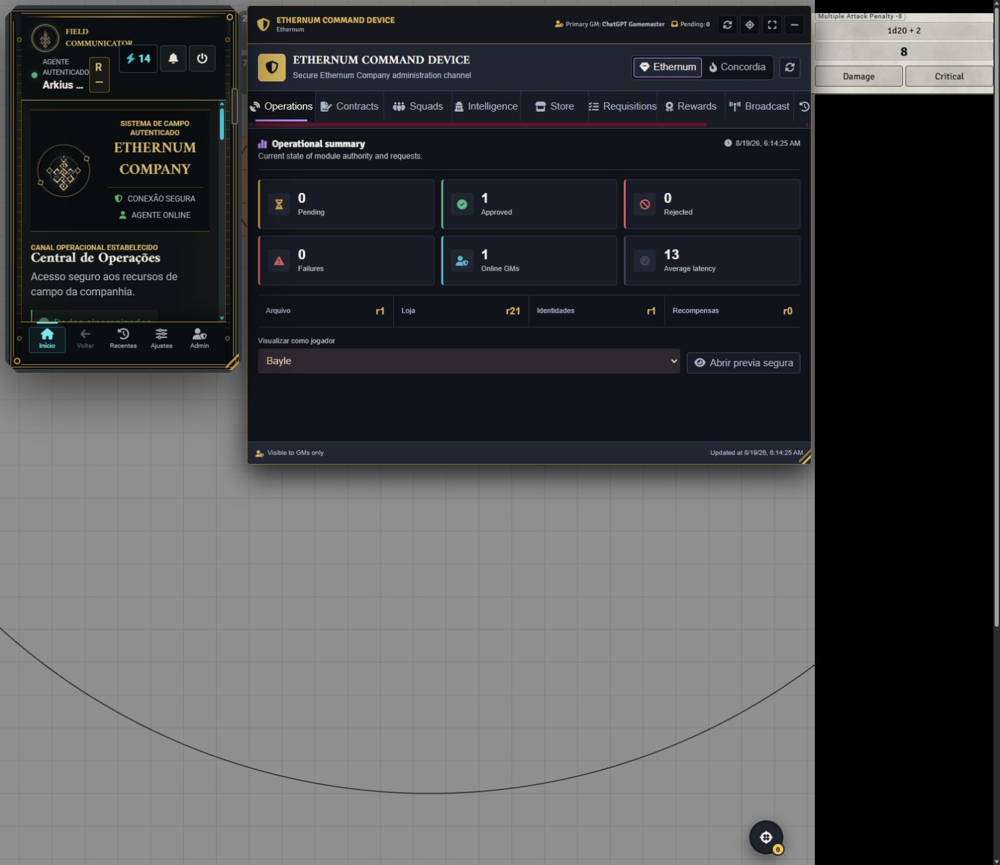

# QA v3.8.3 - Ethernum Command Device

Data: 2026-08-19

Ambiente: mundo PF2e autenticado em `http://localhost:30000/game`, usando a
conta `ChatGPT Gamemaster` como mestre primário.

## Verificações automatizadas

- `npm run typecheck`
- `npm test` (77 arquivos, 575 testes)
- validação do manifesto para `3.8.3`
- build de produção e validação dos imports do pacote

## Smoke test no Foundry

| Caso | Resultado |
| --- | --- |
| Abrir/minimizar e restaurar posição/tamanho | Aprovado |
| Colisão persistida com o Comunicador de Campo | Aprovado; reposicionado sem elevar sobre janelas nativas |
| Operações, Contratos, Equipes, Inteligência e Loja | Aprovado |
| Requisições, Recompensas, Broadcast, Auditoria e Sistema | Aprovado |
| Contrato e inteligência existentes | Renderizados sem alteração de dados |
| Prévia segura como Bayle | Banner visível, identidade projetada e Admin ausente |
| Encerrar prévia | Identidade GM e Admin restaurados |
| Broadcast INFO real | Criado, listado e exibido no chat |
| Exclusão do broadcast | Removido do chat e do painel automaticamente |

## Defeitos encontrados e corrigidos

1. O lançador administrativo podia ficar sob o Comunicador de Campo quando os
   dois restauravam a mesma posição.
2. A prévia não trocava o sujeito quando o comunicador já estava aberto e não
   restaurava o mestre ao sair da tela inicial.
3. A lista de broadcasts ficava desatualizada após exclusão externa da mensagem.

Os dois broadcasts temporários foram excluídos após o teste. Não foram criados
Items, recompensas, contratos ou alterações de personagem.

## Evidência

