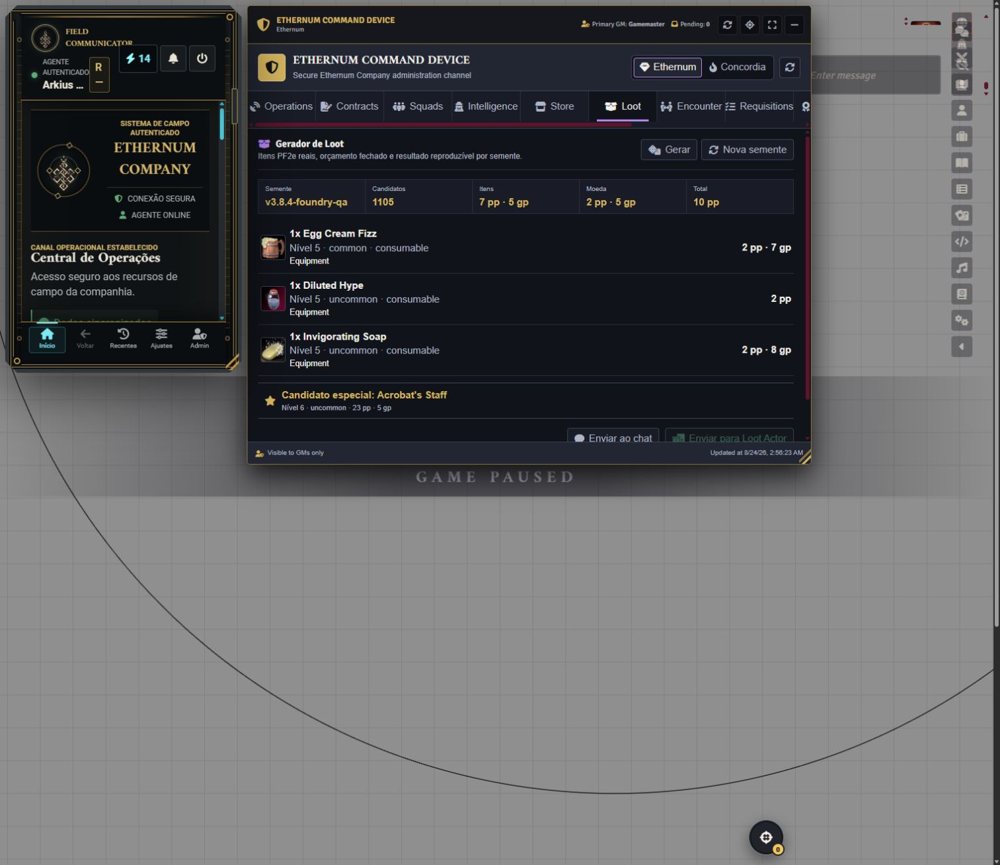
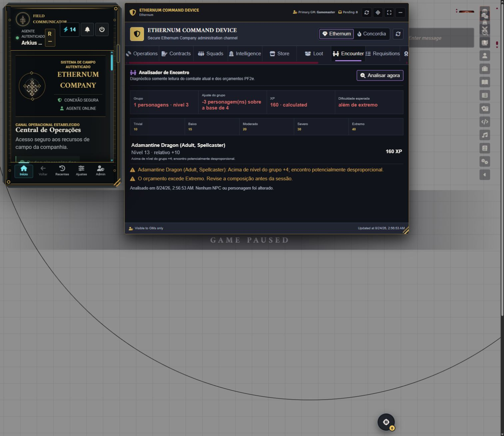

# QA v3.8.4 - Loot Generator and Encounter Analyzer

Date: 2026-08-24

Environment: authenticated PF2e world at `http://localhost:30000/game`, using
`ChatGPT Gamemaster` as a secondary GM and `Gamemaster` as the primary authority.

## Automated verification

- `npm run typecheck`
- `npm test` - 80 test files and 588 tests passed
- release manifest and production build validation
- deterministic seed, filters, budget, prepared XP and out-of-range tests
- persistent delivery idempotency, rollback and tamper rejection tests

## Foundry smoke test

| Case | Result |
| --- | --- |
| Command Device on a secondary GM | Passed after correcting read authority |
| Default sources | World Items + PF2e Equipment, configurable in the dialog |
| Real PF2e catalog | 1,105 valid candidates indexed in about 0.5 s |
| Seed `v3.8.4-foundry-qa` | Reproduced a 100 gp closed-budget manifest |
| Regenerate | Produced another manifest and preserved the exact total |
| Loot Actor delivery | Disabled in Foundry because the test world has no Loot Actor; transaction covered by automated integration tests |
| Chat publication | Covered with a sanitized ChatMessage integration test; no QA message was left in the world |
| Current encounter | Level-3 party member versus level-13 Adamantine Dragon |
| Difficulty and warning | Beyond extreme; relative level +10 warning shown |
| Actor mutation | None; analyzer has no mutation path |
| Browser console | No new module errors; a PF2e system `ApplicationV1` settings warning observed during the session remains outside the module backlog |

## Defects found and corrected

1. A secondary GM could not mount the Command Device because Store reads were
   incorrectly guarded as primary-only.
2. The Field Communicator could restore after the initial collision check and
   overlap the Command Device.
3. The module still registered the deprecated `renderChatMessage` hook on
   Foundry 14 instead of the modern HTML hook.
4. The source dialog initially selected every Item compendium, including packs
   that could never yield physical loot.

The initial overlap captures are retained as defect evidence. The final captures
show the corrected side-by-side layout.

## Evidence

